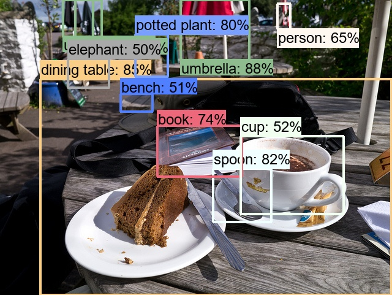

# YOLOV3 Update(Feb/12/2021)
I have add the testing program calles mod_test.py and mod_evaluator.py 

I have add the mod_train.py which can use to train your own custom data. 

I will make the code clean and easier to understand later.

I have trained on coco128(80 classes 128 images) to test the training pipline:

Examples of the result : https://github.com/tokyo-ai/mobilenetv2-based_yolo3_main/tree/main/custom_data_yolo/valid_results

Training log:  https://github.com/tokyo-ai/mobilenetv2-based_yolo3_main/blob/main/training_log_12Feb.txt




## Custom train directory 
The directory structure for image data should be as follows. The test directory is totally separated to the training and validation
```
custom_data_yolo
|-- train
|   |-- images
|   |-- labels
|-- valid
|   |-- images
|   |-- labels
|-- valid_results
```

## To train on yolo format, please modify the mod_train.py to poin to the config file below
https://github.com/tokyo-ai/mobilenetv2-based_yolo3_main/blob/main/config/yolov3_config_yoloformat.py

## Training script

```
python mod_train.py --train_dir ./custom_data_yolo/train/ --valid_dir ./custom_data_yolo/valid/
```
```
Optional:

'--weight_path', type=str, default='./weight/12Fed2021-1/best.pt', help='weight file path to load'

'--resume', action='store_true',default=False,  help='resume training flag'

'--save_weight_dir', type=str, default='./weight', help='weight file path to save'

'--gpu_id', type=int, default=0, help='gpu id'
```

## To test on your own images
The tested images should be in the   "./test_data/test/images"

The result of the inference will be in the  " ./test_data/test_results"

Please specify the weight in the mod_test.py. or passing the argument

```
python mod_test.py --img_test_dir ./test_data/test/images --use_weight_path weight/12Fed2021-2/best.pt
```
```
Optional:

'--annotation_dir', type=str, default='./test_data/test/labels', help='annotation path for mAP or '' or None ex. ./test_data/test/labels'

'--gpu_id', type=int, default=0, help='gpu id'
```
